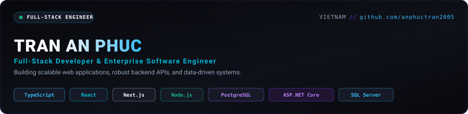

<p align="center">
  
</p>

<p align="center">
  <a href="https://github.com/anphuctran2005">
    
  </a>
</p>

<p align="center">
  <a href="mailto:anphuctran24@gmail.com"></a>
  &nbsp;
  <a href="https://github.com/anphuctran2005"></a>
  &nbsp;
  <a href="https://www.facebook.com/anphuctran05"></a>
  &nbsp;
  
</p>

---

### 👨‍💻 About Me

- 🔭 **Current Focus:** Building production-grade full-stack web applications with **TypeScript, React, Next.js, Node.js, and PostgreSQL**.
- 💼 **Enterprise Background:** Software Developer at **Quang Viet Long An Company** — developed internal enterprise systems with **C#, ASP.NET Core, SQL Server, and Dapper**.
- 🧠 **Engineering Mindset:** Strong advocate for **Clean Architecture, strict type safety, relational data integrity**, and contract-driven API design.
- 🛠️ **Core Strengths:** Bridging real-world enterprise backend discipline (concurrency, transaction boundaries, indexing) with modern, high-velocity JavaScript/TypeScript workflows.
- 📫 **Reach me:** [anphuctran24@gmail.com](mailto:anphuctran24@gmail.com)

---

### 💼 Enterprise Experience &amp; Professional Background

#### **Software Developer · Enterprise Internal Systems**  
*Quang Viet Long An Company*

- **Flagship Enterprise Platform — Improvement Proposal System (Kaizen Platform):**
  - Designed and delivered an internal web system to transition paper-based kaizen proposals into an automated digital workflow across departments.
  - Implemented multi-tier approval hierarchies, role-based access control (RBAC), and automated audit trails.
  - Engineered relational schemas in **SQL Server** with indexed queries and transaction isolation to support concurrent operational reviews.
- **Technologies:** `C#` · `ASP.NET Core` · `SQL Server` · `Dapper` · `Windows Server` · `REST API`
- **Enterprise Foundation as an Asset:**
  - Experience in an enterprise manufacturing environment instilled deep discipline in transaction safety, schema migrations, domain modeling, and long-term maintainability.
  - This background directly elevates how I architect modern **TypeScript**, **Node.js**, and **PostgreSQL** applications today.

---

### 🛠️ Tech Stack &amp; Tools

<p align="left">
  <strong>Frontend:</strong><br />
  
  
  
  
  
  
  
</p>

<p align="left">
  <strong>Backend &amp; Enterprise:</strong><br />
  
  
  
  
  
  
</p>

<p align="left">
  <strong>Databases &amp; Storage:</strong><br />
  
  
  
  
</p>

<p align="left">
  <strong>DevOps &amp; Engineering Workflow:</strong><br />
  
  
  
  
  
</p>

---

### 🚀 Featured Projects

| Project | Description | Tech Stack | Source Code |
| :--- | :--- | :--- | :---: |
| **[Productivity App](https://github.com/anphuctran2005/ProductivityApp)** | Full-stack task &amp; workflow management platform featuring layered Clean Architecture, JWT authentication, and relational data persistence. | `React Native` · `TypeScript` · `ASP.NET Core` · `PostgreSQL` · `Dapper` · `Docker` | [GitHub Repo](https://github.com/anphuctran2005/ProductivityApp) |
| **[Music Mashup Engine](https://github.com/anphuctran2005/audio-mixer-poc)** | Interactive client-side audio mixing tool leveraging the HTML5 Web Audio API for real-time multi-track playback and frequency analysis. | `React` · `JavaScript` · `TypeScript` · `Node.js` · `Web Audio API` | [GitHub Repo](https://github.com/anphuctran2005/audio-mixer-poc) |
| **[Smart TOEIC 4-Skills](https://github.com/anphuctran2005/Learn-TOEIC)** | Structured exam preparation application featuring interactive question banks, synchronized audio listening tests, and progress analytics. | `React` · `TypeScript` · `Node.js` · `PostgreSQL` | [GitHub Repo](https://github.com/anphuctran2005/Learn-TOEIC) |
| **[PromptVault](https://github.com/anphuctran2005/PromptVault)** | Centralized full-stack web application designed to store, organize, version, and search structured prompt templates for developer workflows. | `React` · `ASP.NET Core` · `SQL Server` · `REST API` | [GitHub Repo](https://github.com/anphuctran2005/PromptVault) |
| **Kaizen Platform** | Company-wide internal system digitizing employee improvement proposals with multi-tier approval hierarchies and KPI dashboards. | `C#` · `ASP.NET Core` · `SQL Server` · `Dapper` | *Enterprise Internal System* |

---

### 💡 Engineering Principles

```
Requirement Analysis ──► Domain Modeling ──► Implementation ──► Automated Testing ──► Code Review ──► Delivery
```

1. **Understand Before Automating:** Clarify business logic, data models, and edge cases thoroughly before writing code.
2. **Type Safety Across Boundaries:** Strict typing (TypeScript &amp; C#) reduces runtime regressions and simplifies refactoring.
3. **Database-First Integrity:** Business rules belong in thoughtful data constraints, transactions, and explicit domain boundaries.
4. **Pragmatic Modern Tooling:** Leverage modern developer workflows (including AI tools for scaffolding, test generation, and regex/syntax acceleration) while maintaining 100% architectural comprehension and code ownership.

---

### 📈 GitHub Statistics &amp; Activity

<div align="center">
  <a href="https://github.com/anphuctran2005">
    
  </a>
  &nbsp;
  <a href="https://github.com/anphuctran2005">
    
  </a>
</div>

<div align="center">
  
</div>

<br />

<div align="center">
  
</div>

---

### 📫 Get in Touch

<p align="center">
  <a href="mailto:anphuctran24@gmail.com">
    
  </a>
  &nbsp;&nbsp;
  <a href="https://github.com/anphuctran2005">
    
  </a>
  &nbsp;&nbsp;
  <a href="https://www.facebook.com/anphuctran05">
    
  </a>
</p>

<p align="center">
  <sub>Designed &amp; Maintained by <strong>Tran An Phuc</strong> · 2026</sub>
</p>
