<p align="center">
  <a href="https://github.com/anphuctran2005">
    
  </a>
</p>

<p align="center">
  
</p>

<p align="center">
  <a href="mailto:anphuctran24@gmail.com"></a>
  &nbsp;
  <a href="https://github.com/anphuctran2005"></a>
  &nbsp;
  <a href="https://www.facebook.com/anphuctran05"></a>
  &nbsp;
  
</p>

<p align="center">⭐━━━━━━━━━━━━━━「 <b>DUELIST PROFILE CARD</b> 」━━━━━━━━━━━━━━⭐</p>

### 🎴 About This Duelist

- 🔭 **Current Quest:** Building production-grade full-stack web applications with **TypeScript, React, Next.js, Node.js, and PostgreSQL**.
- 💼 **Guild Affiliation:** Software Developer at **Quang Viet Long An Company** — forging internal enterprise systems with **C#, ASP.NET Core, SQL Server, and Dapper**.
- 🧠 **Duelist Philosophy:** Strong advocate for **Clean Architecture, strict type safety, relational data integrity**, and contract-driven API design.
- 🛡️ **Signature Combo:** Bridging real-world enterprise backend discipline (concurrency, transaction boundaries, indexing) with modern, high-velocity JavaScript/TypeScript workflows.
- 📜 **Summon Me:** [anphuctran24@gmail.com](mailto:anphuctran24@gmail.com)

<p align="center">⭐━━━━━━━━━━━━━━「 <b>DUEL HISTORY — WORK EXPERIENCE</b> 」━━━━━━━━━━━━━━⭐</p>

### 🏆 Duel History &amp; Professional Background

#### **Software Developer · Enterprise Internal Systems**
*Quang Viet Long An Company*

- **🃏 Boss Monster Cleared — Improvement Proposal System (Kaizen Platform):**
  - Designed and delivered an internal web system to transition paper-based kaizen proposals into an automated digital workflow across departments.
  - Implemented multi-tier approval hierarchies, role-based access control (RBAC), and automated audit trails.
  - Engineered relational schemas in **SQL Server** with indexed queries and transaction isolation to support concurrent operational reviews.
- **Equipped Cards:** `C#` · `ASP.NET Core` · `SQL Server` · `Dapper` · `Windows Server` · `REST API`
- **🎖️ Passive Skill — Enterprise Foundation:**
  - Experience in an enterprise manufacturing environment instilled deep discipline in transaction safety, schema migrations, domain modeling, and long-term maintainability.
  - This background directly powers up how I architect modern **TypeScript**, **Node.js**, and **PostgreSQL** applications today.

<p align="center">⭐━━━━━━━━━━━━━━「 <b>MY DECK — TECH STACK</b> 」━━━━━━━━━━━━━━⭐</p>

### 🃏 Monster Deck — Tech Stack

<p align="left">
  <strong>⚔️ Normal Monsters — Frontend</strong><br />
  
  
  
  
  
  
  
</p>

<p align="left">
  <strong>🪄 Effect Monsters — Backend &amp; Enterprise</strong><br />
  
  
  
  
  
  
</p>

<p align="left">
  <strong>🏛️ Field Spells — Databases &amp; Storage</strong><br />
  
  
  
  
</p>

<p align="left">
  <strong>🪤 Trap Cards — DevOps &amp; Workflow</strong><br />
  
  
  
  
  
</p>

<p align="center">⭐━━━━━━━━━━━━━━「 <b>BOSS MONSTERS — FEATURED PROJECTS</b> 」━━━━━━━━━━━━━━⭐</p>

### ⚡ Boss Monsters — Featured Projects

| Card | Effect (Description) | ATK / DEF (Tech Stack) | Source |
| :--- | :--- | :--- | :---: |
| **[Productivity App](https://github.com/anphuctran2005/ProductivityApp)** | Full-stack task &amp; workflow management platform featuring layered Clean Architecture, JWT authentication, and relational data persistence. | `React Native` · `TypeScript` · `ASP.NET Core` · `PostgreSQL` · `Dapper` · `Docker` | [GitHub Repo](https://github.com/anphuctran2005/ProductivityApp) |
| **[Music Mashup Engine](https://github.com/anphuctran2005/audio-mixer-poc)** | Interactive client-side audio mixing tool leveraging the HTML5 Web Audio API for real-time multi-track playback and frequency analysis. | `React` · `JavaScript` · `TypeScript` · `Node.js` · `Web Audio API` | [GitHub Repo](https://github.com/anphuctran2005/audio-mixer-poc) |
| **[Smart TOEIC 4-Skills](https://github.com/anphuctran2005/Learn-TOEIC)** | Structured exam preparation application featuring interactive question banks, synchronized audio listening tests, and progress analytics. | `React` · `TypeScript` · `Node.js` · `PostgreSQL` | [GitHub Repo](https://github.com/anphuctran2005/Learn-TOEIC) |
| **[PromptVault](https://github.com/anphuctran2005/PromptVault)** | Centralized full-stack web application designed to store, organize, version, and search structured prompt templates for developer workflows. | `React` · `ASP.NET Core` · `SQL Server` · `REST API` | [GitHub Repo](https://github.com/anphuctran2005/PromptVault) |
| **Kaizen Platform** | Company-wide internal system digitizing employee improvement proposals with multi-tier approval hierarchies and KPI dashboards. | `C#` · `ASP.NET Core` · `SQL Server` · `Dapper` | *Enterprise Internal System* |

<p align="center">⭐━━━━━━━━━━━━━━「 <b>DUEL FIELD — ENGINEERING PRINCIPLES</b> 」━━━━━━━━━━━━━━⭐</p>

### 📜 Spell Chain — Engineering Principles

```
Requirement Analysis ──► Domain Modeling ──► Implementation ──► Automated Testing ──► Code Review ──► Delivery
```

1. **Understand Before Automating:** Clarify business logic, data models, and edge cases thoroughly before writing code.
2. **Type Safety Across Boundaries:** Strict typing (TypeScript &amp; C#) reduces runtime regressions and simplifies refactoring.
3. **Database-First Integrity:** Business rules belong in thoughtful data constraints, transactions, and explicit domain boundaries.
4. **Pragmatic Modern Tooling:** Leverage modern developer workflows (including AI tools for scaffolding, test generation, and regex/syntax acceleration) while maintaining 100% architectural comprehension and code ownership.

<p align="center">⭐━━━━━━━━━━━━━━「 <b>LIFE POINTS — GITHUB STATS</b> 」━━━━━━━━━━━━━━⭐</p>

### 💜 Life Points &amp; Duel Stats

<div align="center">
  <a href="https://github.com/anphuctran2005">
    
  </a>
  &nbsp;
  <a href="https://github.com/anphuctran2005">
    
  </a>
</div>

<div align="center">
  
</div>

<br />

<div align="center">
  
</div>

<p align="center">⭐━━━━━━━━━━━━━━「 <b>DIRECT ATTACK — GET IN TOUCH</b> 」━━━━━━━━━━━━━━⭐</p>

<p align="center">
  <a href="mailto:anphuctran24@gmail.com">
    
  </a>
  &nbsp;&nbsp;
  <a href="https://github.com/anphuctran2005">
    
  </a>
  &nbsp;&nbsp;
  <a href="https://www.facebook.com/anphuctran05">
    
  </a>
</p>

<p align="center">
  <sub>🎴 "I summon... my next commit, in Attack Position!" — <strong>Tran An Phuc</strong> · 2026</sub>
</p>

<p align="center">
  
</p>
