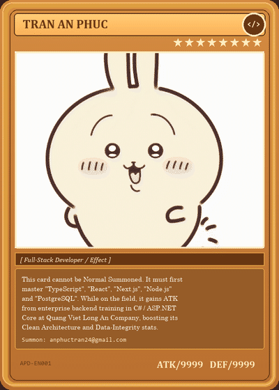

  

  

  
  &nbsp;
  
  &nbsp;
  
  &nbsp;
  

### About

Full-stack developer building production-grade web applications with TypeScript, React, Next.js, Node.js, and PostgreSQL. Software Developer at Quang Viet Long An Company, where I build internal enterprise systems with C#, ASP.NET Core, SQL Server, and Dapper — applying Clean Architecture, strict type safety, and contract-driven API design.

### Experience

**Software Developer · Quang Viet Long An Company**
Built the Improvement Proposal System (Kaizen Platform) — an internal web system digitizing paper-based kaizen proposals, with multi-tier approval hierarchies, RBAC, and audit trails. Stack: `C#` · `ASP.NET Core` · `SQL Server` · `Dapper` · `REST API`.

### Tech Stack

| Frontend | Backend | Database | DevOps |
| :--- | :--- | :--- | :--- |
| TypeScript JavaScript React Next.js Tailwind CSS | Node.js Express C# ASP.NET Core Dapper | PostgreSQL SQL Server | Git Docker GitHub Actions |

### Featured Projects

| Project | Description | Tech Stack | Source |
| :--- | :--- | :--- | :---: |
| **[Productivity App](https://github.com/anphuctran2005/ProductivityApp)** | Full-stack task &amp; workflow management platform featuring layered Clean Architecture, JWT authentication, and relational data persistence. | `React Native` · `TypeScript` · `ASP.NET Core` · `PostgreSQL` · `Dapper` · `Docker` | [GitHub Repo](https://github.com/anphuctran2005/ProductivityApp) |
| **[Music Mashup Engine](https://github.com/anphuctran2005/audio-mixer-poc)** | Interactive client-side audio mixing tool leveraging the HTML5 Web Audio API for real-time multi-track playback and frequency analysis. | `React` · `JavaScript` · `TypeScript` · `Node.js` · `Web Audio API` | [GitHub Repo](https://github.com/anphuctran2005/audio-mixer-poc) |
| **[Smart TOEIC 4-Skills](https://github.com/anphuctran2005/Learn-TOEIC)** | Structured exam preparation application featuring interactive question banks, synchronized audio listening tests, and progress analytics. | `React` · `TypeScript` · `Node.js` · `PostgreSQL` | [GitHub Repo](https://github.com/anphuctran2005/Learn-TOEIC) |
| **[PromptVault](https://github.com/anphuctran2005/PromptVault)** | Centralized full-stack web application designed to store, organize, version, and search structured prompt templates for developer workflows. | `React` · `ASP.NET Core` · `SQL Server` · `REST API` | [GitHub Repo](https://github.com/anphuctran2005/PromptVault) |
| **Kaizen Platform** | Company-wide internal system digitizing employee improvement proposals with multi-tier approval hierarchies and KPI dashboards. | `C#` · `ASP.NET Core` · `SQL Server` · `Dapper` | *Enterprise Internal System* |

### GitHub Stats

  
  &nbsp;
  

  

---

Contact: [anphuctran24@gmail.com](mailto:anphuctran24@gmail.com) · [GitHub](https://github.com/anphuctran2005) · [Facebook](https://www.facebook.com/anphuctran05)
