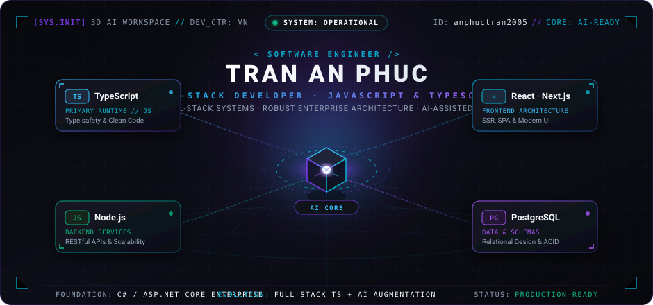
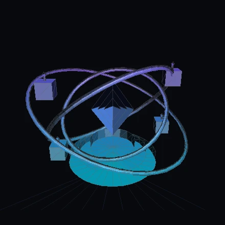
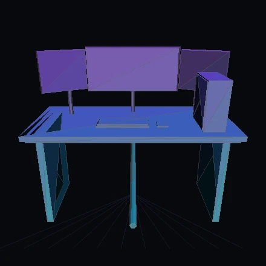
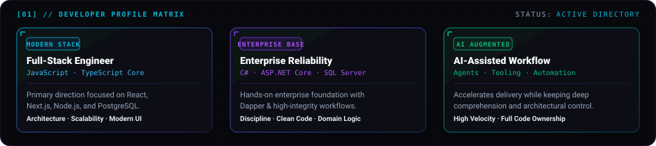
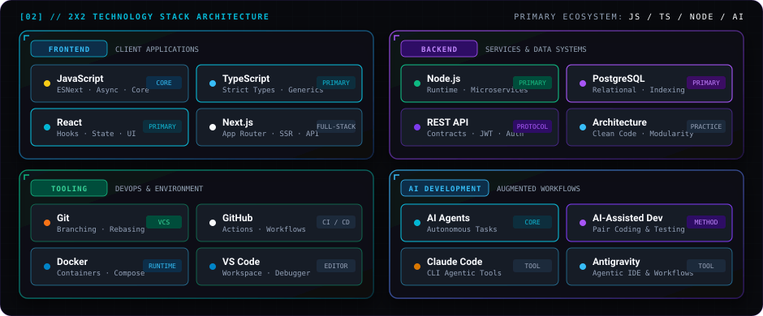
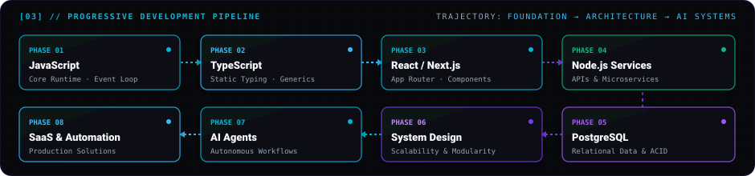
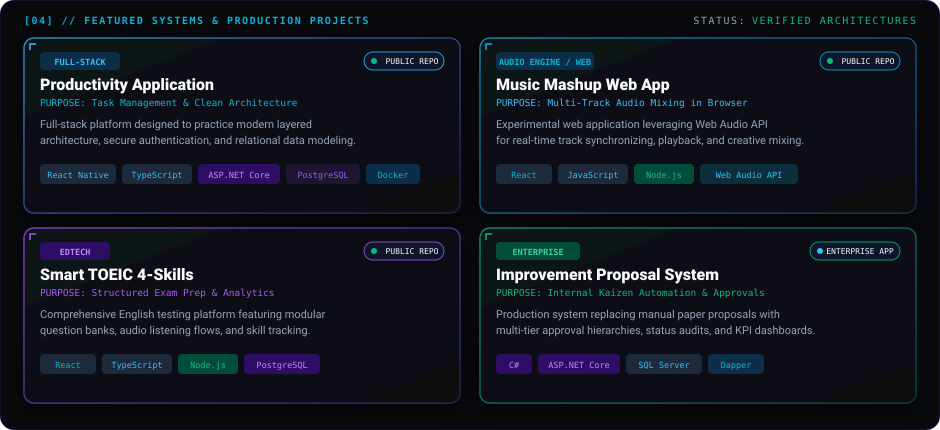
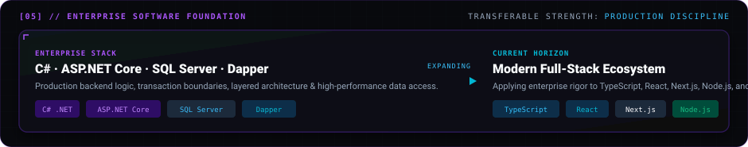
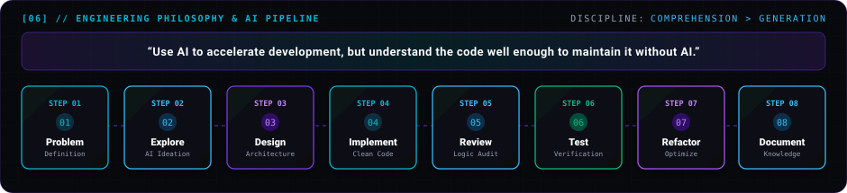
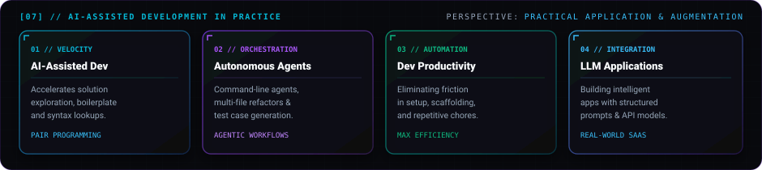

<p align="center">
  
</p>

<p align="center">
  <a href="mailto:anphuctran24@gmail.com">
    
  </a>
  &nbsp;&nbsp;
  <a href="https://github.com/anphuctran2005">
    
  </a>
  &nbsp;&nbsp;
  <a href="https://www.facebook.com/anphuctran05">
    
  </a>
</p>

<p align="center">
  <a href="https://anphuctran2005.github.io/anphuctran2005/">
    
  </a>
</p>

<p align="center">
  
</p>

## 🎮 // 3D MODELS &amp; INTERACTIVE WORKSPACE

> **Real 3D Geometric Meshes (.STL / .OBJ / WebGL)** — Click any model below to open GitHub's native interactive 3D viewer (pan, zoom, orbit in 3D).

<table>
  <tr>
    <td align="center" width="50%" valign="top">
      <a href="assets/models/ai-core.stl">
        
      </a>
      <br />
      <strong>3D AI Core Nucleus</strong>
      <br />
      <sub>Crystalline core with orbital gimbal rings &amp; tech satellites</sub>
      <br /><br />
      <a href="assets/models/ai-core.stl">🎮 <strong>Open in GitHub 3D Viewer (.stl)</strong></a>
      &nbsp;·&nbsp;
      <a href="assets/models/ai-core.obj">📦 <strong>Source (.obj)</strong></a>
    </td>
    <td align="center" width="50%" valign="top">
      <a href="assets/models/developer-workspace.stl">
        
      </a>
      <br />
      <strong>3D Developer Workstation</strong>
      <br />
      <sub>Curved triple monitor rig, cyber console &amp; compute tower</sub>
      <br /><br />
      <a href="assets/models/developer-workspace.stl">🎮 <strong>Open in GitHub 3D Viewer (.stl)</strong></a>
      &nbsp;·&nbsp;
      <a href="assets/models/developer-workspace.obj">📦 <strong>Source (.obj)</strong></a>
    </td>
  </tr>
</table>

<p align="center">
  <small>
    📦 <em>Additional 3D Models in repository:</em>
    <a href="assets/models/tech-matrix.stl"><strong>[3D Tech Matrix .stl]</strong></a> ·
    <a href="assets/models/tech-matrix.obj"><strong>[3D Tech Matrix .obj]</strong></a> ·
    <a href="assets/models/cyber-materials.mtl"><strong>[Cyber Materials .mtl]</strong></a>
  </small>
</p>

<p align="center">
  
</p>

## 01 // DEVELOPER IDENTITY

<p align="center">
  
</p>

I am a **Full-Stack Developer** focused on building production-grade web systems within the **JavaScript / TypeScript** ecosystem.

- **Primary Stack:** TypeScript, JavaScript, React, Next.js, Node.js, and PostgreSQL.
- **Enterprise Heritage:** Real-world engineering experience with C#, ASP.NET Core, SQL Server, and Dapper.
- **AI-Augmented Engineering:** Leveraging autonomous agents and AI tooling to accelerate delivery while maintaining complete code comprehension and architectural integrity.
- **Methodology:** Practical, project-centric development where maintainability, clean architecture, and business impact come first.

<p align="center">
  
</p>

## 02 // TECH STACK ARCHITECTURE

<p align="center">
  
</p>

| Domain | Core Technologies &amp; Practices | Primary Focus |
| :--- | :--- | :--- |
| **Frontend** | `JavaScript (ESNext)` · `TypeScript` · `React` · `Next.js` · `HTML5` · `CSS3` | Modern SPA/SSR architectures, responsive interfaces, strict typing |
| **Backend &amp; Data** | `Node.js` · `PostgreSQL` · `RESTful APIs` · `System Architecture` | Relational data modeling, ACID transactions, modular clean code |
| **Tooling &amp; Platform** | `Git` · `GitHub Actions` · `Docker` · `VS Code` · `Linux CLI` | Reproducible containers, automated workflows, version control |
| **AI Development** | `AI Agents` · `AI-Assisted Coding` · `Claude Code` · `Antigravity` | Agentic task orchestration, rapid prototyping, test automation |

<p align="center">
  
</p>

## 03 // CURRENT FOCUS &amp; TRAJECTORY

<p align="center">
  
</p>

My technical trajectory is deliberately structured from foundational language mastery to scalable cloud services and intelligent systems:

```
JavaScript ──► TypeScript ──► React / Next.js ──► Node.js
                                                    │
SaaS / Automation ◄── AI Agents ◄── System Design ◄── PostgreSQL
```

I am focused on end-to-end full-stack engineering: defining domain boundaries, implementing resilient backend services, crafting high-performance frontend interfaces, and utilizing AI agents to eliminate development friction.

<p align="center">
  
</p>

## 04 // FEATURED PROJECTS

<p align="center">
  
</p>

### 📱 [Productivity Application](https://github.com/anphuctran2005/ProductivityApp)
> **Full-Stack Task &amp; Workflow Platform**
- **Architecture:** Multi-layered clean architecture separating presentation, domain, and data persistence layers.
- **Capabilities:** Task management, secure JWT authentication, API contract design, and relational database schema modeling.
- **Technologies:** `React Native` · `TypeScript` · `ASP.NET Core` · `PostgreSQL` · `Dapper` · `Docker`
- **Source:** [`github.com/anphuctran2005/ProductivityApp`](https://github.com/anphuctran2005/ProductivityApp)

---

### 🎵 [Music Mashup Web Application](https://github.com/anphuctran2005/audio-mixer-poc)
> **In-Browser Audio Engine &amp; Creative Multi-Track Mixing**
- **Architecture:** Interactive client-side audio pipeline utilizing the HTML5 Web Audio API.
- **Capabilities:** Multi-channel audio synchronization, real-time waveform playback controls, and client-side processing.
- **Technologies:** `React` · `JavaScript` · `TypeScript` · `Node.js` · `Web Audio API`
- **Source:** [`github.com/anphuctran2005/audio-mixer-poc`](https://github.com/anphuctran2005/audio-mixer-poc)

---

### 🎧 [Smart TOEIC 4-Skills](https://github.com/anphuctran2005/Learn-TOEIC)
> **Structured English Exam Preparation &amp; Assessment Platform**
- **Architecture:** Modular learning platform optimized for interactive test simulations and practice analytics.
- **Capabilities:** Structured question repositories, audio playback test flows, progress assessment, and relational storage.
- **Technologies:** `React` · `TypeScript` · `Node.js` · `PostgreSQL`
- **Source:** [`github.com/anphuctran2005/Learn-TOEIC`](https://github.com/anphuctran2005/Learn-TOEIC)

---

### ⚙️ Improvement Proposal System (Kaizen)
> **Internal Enterprise Workflow Automation &amp; Approval Engine**
- **Architecture:** Enterprise production application deployed to replace manual paper proposals with an automated system.
- **Capabilities:** Multi-tier departmental approval hierarchies, audit trails, proposal status tracking, and KPI reporting.
- **Technologies:** `C#` · `ASP.NET Core` · `SQL Server` · `Dapper`
- **Status:** *Production Enterprise Application (Quang Viet Long An)*

<p align="center">
  
</p>

## 05 // ENTERPRISE EXPERIENCE

<p align="center">
  
</p>

> *I have practical enterprise software experience and am now extending that foundation into the modern JavaScript ecosystem.*

Working with **C#**, **ASP.NET Core**, **SQL Server**, and **Dapper** in an enterprise production environment provided a rigorous foundation:

- **Data Integrity &amp; Transactions:** Designing strict relational models, query performance optimization, and ACID guarantees.
- **Layered Architecture:** Clear decoupling between domain logic, data access, and API controllers.
- **Maintainability:** Writing defensive, typed code that enterprise teams can operate and maintain over multi-year lifecycles.

This background is an intentional asset: it informs how I design **TypeScript**, **Node.js**, and **PostgreSQL** architectures today.

<p align="center">
  
</p>

## 06 // ENGINEERING PHILOSOPHY

<p align="center">
  
</p>

> **"Use AI to accelerate development, but understand the code well enough to maintain it without AI."**

I treat AI as an engineering amplifier rather than an oracle:

1. **Problem Definition:** Establish unambiguous domain requirements before writing any code.
2. **Explore Alternatives:** Use AI models to quickly survey architectural trade-offs and edge cases.
3. **Intentional Design:** Define data models, interfaces, and boundary contracts manually.
4. **Implementation:** Pair with AI tools for rapid scaffolding and syntax acceleration.
5. **Code Review &amp; Audit:** Review every generated line with rigorous engineering scrutiny.
6. **Automated Testing:** Verify behavior through unit, integration, and contract tests.
7. **Refactoring:** Simplify abstractions and eliminate unnecessary complexity.
8. **Documentation:** Produce clear technical documentation for future maintainers.

The primary objective is never raw line count—it is building reliable systems whose internal mechanics are thoroughly understood.

<p align="center">
  
</p>

## 07 // AI DEVELOPMENT IN PRACTICE

<p align="center">
  
</p>

*Exploring practical AI-assisted software development and AI-powered applications.*

- **AI-Assisted Development:** Utilizing modern LLMs as interactive pair programmers for debugging, design validation, and architectural prototyping.
- **Autonomous Dev Agents:** Incorporating command-line agentic tooling (such as Claude Code and Antigravity) for multi-file refactoring, test generation, and automated code review.
- **Developer Productivity:** Automating boilerplate setup, CI script writing, and documentation generation to maximize focus on core business logic.
- **LLM-Powered Applications:** Exploring real-world applications (such as [PromptVault](https://github.com/anphuctran2005/PromptVault)) that store, version, and orchestrate structured prompts for LLM integrations.

<p align="center">
  
</p>

## 08 // GITHUB ACTIVITY &amp; METRICS

<div align="center">
  <a href="https://github.com/anphuctran2005">
    
  </a>
  &nbsp;
  <a href="https://github.com/anphuctran2005">
    
  </a>
</div>

<br />

<div align="center">
  
</div>

<p align="center">
  
</p>

## 09 // CONNECT &amp; TRANSMISSION

<p align="center">
  <a href="mailto:anphuctran24@gmail.com">
    
  </a>
  &nbsp;&nbsp;&nbsp;&nbsp;
  <a href="https://github.com/anphuctran2005">
    
  </a>
  &nbsp;&nbsp;&nbsp;&nbsp;
  <a href="https://www.facebook.com/anphuctran05">
    
  </a>
</p>

<br />

<p align="center">
  
</p>
